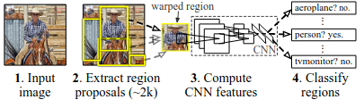

# 

As two-stage object detector, R-CNN follows following system overview.

1. Takes an input image
2. Extracts around 2000 buttom-up region proposals
3. Computes features for each proposal using a large Convolutional Neural Network (CNN)
4. Classifes each region using class-specific linear SVMs (Support Vector Machine)

Based on these, the algorithm can be realised as three modules. The first generates **category-independent region proposals**. These proposal define the set of candidate detections available to the detector. The second module is **a large convolutional neural network** that extracts a fixed-length feature vector from each region. The third module is a set of **class-specific linear SVMs**.