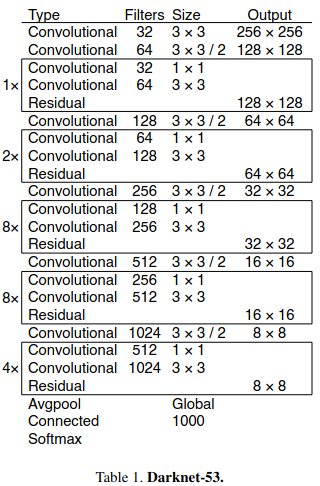

# You Only Look Once (YOLO)

The original YOLO (You Only Look Once) paper proposed an object detection algorithm that achieved real-time performance while maintaining high accuracy.

The algorithm divides an image into a grid of cells and predicts bounding boxes and class probabilities for each cell. This is done using a single convolutional neural network that simultaneously predicts multiple bounding boxes and their class probabilities for each object.

The predicted bounding boxes are adjusted for their corresponding cell coordinates and anchor boxes, which are pre-defined boxes of different sizes and aspect ratios. The class probabilities are also adjusted for the confidence of the predicted boxes.

YOLOv3 is an improved version of the original YOLO algorithm that addresses some of its limitations. Here are some of the key differences:

1. Feature extraction: YOLOv3 uses a deeper neural network with three times more convolutional layers than the original YOLO, which enables it to detect smaller objects with greater accuracy.

2. Multi-scale prediction: YOLOv3 predicts objects at three different scales instead of one, using feature maps from different layers of the neural network. This allows it to detect objects of varying sizes more accurately.

3. Anchor boxes: YOLOv3 uses a technique called anchor boxes, where each predicted box is associated with a set of pre-defined anchor boxes with different sizes and aspect ratios. This enables it to detect objects with different shapes more accurately.

4. Improved loss function: YOLOv3 uses a modified loss function that takes into account the confidence scores of the predicted boxes, which improves its accuracy in detecting small objects and objects with low contrast.

## DarkNet-53

YOLOv3 uses a convolutional neural network (CNN) based on the Darknet architecture, which is a custom designed CNN that was specifically developed for object detection. The Darknet architecture uses a series of convolutional layers followed by max-pooling layers to extract features from the input image.

The YOLOv3 network consists of 53 convolutional layers followed by 4 max-pooling layers, which is significantly deeper than the original YOLO network. The network uses skip connections to combine features from different layers, which improves its ability to detect small objects and objects with low contrast.

The YOLOv3 network also uses residual blocks, which are a type of building block that allows the network to learn residual functions that can capture finer details of the input image. This helps the network to better differentiate between objects with similar features.